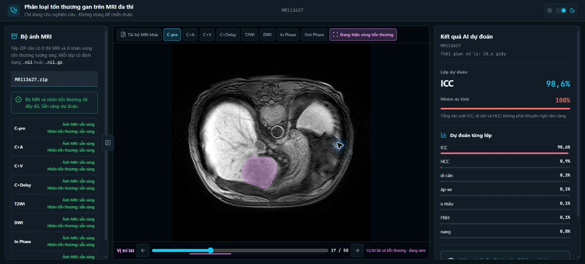

# Phân loại đa lớp tổn thương gan trên MRI 3D đa thì

> **Research Use Only — chưa kiểm định lâm sàng.** Kết quả chỉ dành cho nghiên cứu; không dùng để chẩn đoán, điều trị hoặc thay thế ý kiến bác sĩ.

## Bài toán

Phân loại tổn thương gan ở mức ROI từ khối MRI 3D gồm 8 thì trên dataset [LLD-MMRI](https://github.com/LMMMEng/LLD-MMRI2023) (498 bệnh nhân). Vị trí tổn thương được cung cấp sẵn; đây không phải bài toán phát hiện hay phân vùng.

Mô hình dự đoán 7 lớp: HCC, ICC, di căn, nang, u máu, FNH và áp-xe. Đầu ra gồm xác suất từng lớp, mức bất định và cờ từ chối cho các ca không chắc chắn.

## Kết quả chốt

Đánh giá trên tập test chính thức gồm 104 ca, theo protocol khóa trước. Bộ dự đoán là ensemble 5 fold của UniFormer-S 3D khởi tạo từ Kinetics-400.

| Chỉ số | Giá trị | Ghi chú |
|---|---:|---|
| **Macro-F1** | **0,7682** [0,6902; 0,8422] | κ = 0,7333; accuracy = 0,7788 |
| **ECE chưa hiệu chỉnh** | **0,0833** | Độ tự tin cao hơn accuracy trung bình 0,042 |
| **Macro-F1 tại coverage 80%** | **0,8421** | Tăng 0,0739 [0,0126; 0,1360], P = 0,027 |
| **Coverage tại risk ≤ 10%** | **76,9%** | Tỷ lệ ca hệ thống có thể tự quyết |
| **So với cấu hình đối chứng** | **+0,1520** [0,0647; 0,2421] | P = 0,001; bootstrap ghép cặp |

Kết quả vượt baseline chính thức của challenge (macro-F1 0,6083) với khoảng tin cậy không chứa mốc này. Với cỡ mẫu test 104 ca, chưa thể kết luận tương đương các phương pháp công bố trong khoảng 0,71–0,83.

## Cấu hình chính

| Hạng mục | Thiết lập |
|---|---|
| Kiến trúc | **UniFormer-S 3D**, khởi tạo từ **Kinetics-400** |
| Đầu vào mô hình | 8 kênh × **112 × 112 × 14** |
| Lưới cache | 128 × 128 × 16; train cắt ngẫu nhiên, suy luận cắt giữa |
| Loss | Focal γ = 2 (softmax), trọng số số mẫu hiệu dụng, label smoothing 0,1 |
| Bộ dự đoán | Ensemble 5 fold, trung bình softmax |
| Config | [`configs/uniformer_s.yaml`](configs/uniformer_s.yaml) |

## Cấu trúc repo

| Thư mục | Nội dung |
|---|---|
| `src/` | Code tiền xử lý, huấn luyện và đánh giá chạy trên Kaggle |
| `configs/` | Cấu hình YAML cho từng run |
| `splits/` | Split bệnh nhân chính thức 316/78/104, đã khóa |
| `notebooks/` | Notebook mỏng gọi mã trong `src/` |
| `webapp/` | Demo FastAPI + React/Vite/TypeScript |
| `reports/` | Báo cáo cuối và các hình minh họa |
| `slides/` | Slide HTML |
| `scripts/` | Quality gate và tiện ích |
| `tests/` | Kiểm thử, bao gồm kiểm tra rò rỉ dữ liệu |

## Cài đặt

Hai môi trường được tách riêng để backend demo không phải cài toàn bộ stack huấn luyện:

```bash
pip install -r requirements.txt
pip install -r webapp/backend/requirements.txt
```

## Tái lập kết quả

```bash
# Kiểm tra split chính thức
python -c "from src.data.splits import Splits; Splits('splits').validate()"

# Dựng cache tiền xử lý trên CPU
python -m src.preprocess.build_cache --config configs/preprocess_cghnet.yaml

# Huấn luyện năm fold
for f in 1 2 3 4 5; do
  python -m src.train.run --config configs/uniformer_s.yaml --fold $f
done

# Đánh giá từ xác suất đã lưu
python -m src.eval.run --run-dir runs/Uniformer3D
python -m src.eval.trust --run-dir runs/Uniformer3D
python -m src.eval.compare --baseline runs/E4_cv_results --candidate runs/Uniformer3D
```

Tập test-104 là held-out đã được chạm hai lần hợp lệ. Không chạy lại đánh giá test nếu chưa có sự cho phép và pre-registration được commit trước khi chạy.

## Chạy web app demo



```bash
python -m uvicorn webapp.backend.main:app --reload
cd webapp/frontend && npm install && npm run dev
```

Mở `http://localhost:5173`, tải ZIP chứa 8 chuỗi MRI trong `images/` và 8 nhãn tổn thương tương ứng trong `masks/`. Backend kiểm tra contract dữ liệu, chạy ensemble 5 mô hình và trả về xác suất từng lớp, mức bất định cùng trạng thái từ chối.
