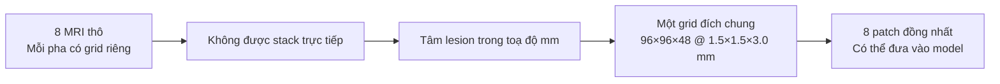
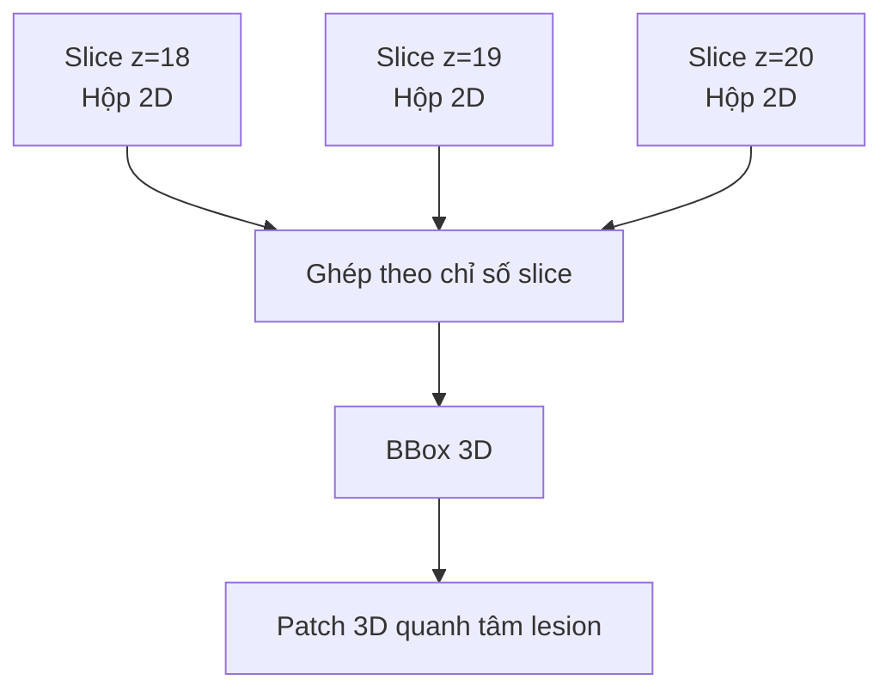
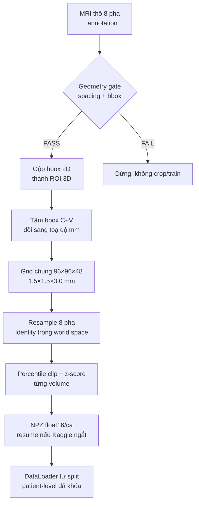
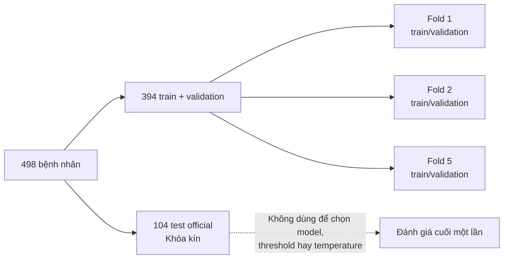

# Audit W2 — LLD-MMRI: từ MRI thô đến dữ liệu sẵn sàng train

**Ngày chốt snapshot:** 27/07/2026

**Trạng thái:** **Research Use Only (RUO)** — phục vụ nghiên cứu, chưa được kiểm định lâm sàng và không dùng để chẩn đoán hay thay thế bác sĩ.
**Phạm vi:** đây là ảnh chụp trạng thái W2 *trước khi train*. Nó không phải tài liệu sống: kết quả cache hoàn chỉnh, train và đánh giá sau thời điểm này phải ghi vào `WORKLOG.md` hoặc report W6.

## Tóm tắt điều hành

LLD-MMRI là bộ dữ liệu phù hợp với câu hỏi nghiên cứu: phân loại **7 loại tổn thương gan** từ MRI 3D **8 pha**. Mỗi bệnh nhân có một tổn thương; model cần học cả hình dạng 3D lẫn cách tổn thương thay đổi tín hiệu giữa các pha.

Tuy vậy, dữ liệu không thể đưa thẳng vào model. Tám pha của cùng một bệnh nhân có kích thước voxel, số lát cắt và độ phân giải khác nhau. Bản dữ liệu đang dùng cũng chỉ có MRI toàn bộ và các hộp chú thích 2D từng lát, không có patch 3D đã cắt sẵn. Pipeline W2 vì thế biến các ảnh thô thành một tensor đồng nhất `[8, 96, 96, 48]` quanh tổn thương, nhưng chỉ sau các kiểm tra hình học nghiêm ngặt.

Các bằng chứng quan trọng đã có là: geometry gate **PASS 3.984/3.984** pha, và thứ tự trục bbox được xác nhận là **`xy`** với **166/180 phiếu (92%)**. Cache 498 ca vẫn đang chờ kiểm chứng cuối cùng; vì vậy chưa được gọi là “train-ready hoàn toàn”.

> **Trạng thái tại snapshot:** xác minh geometry và quyết định trục đã hoàn thành; kiểm tra overlay bằng mắt, build cache 498 ca, kiểm 498 file và tạo Kaggle Dataset private vẫn là các bước nghiệm thu bắt buộc.

## 1. Dataset nói bằng ngôn ngữ đơn giản

### 1.1 Bài toán thực sự là gì?

Một lần chụp MRI đa pha giống như chụp cùng một tổn thương nhiều lần bằng những “bộ lọc” khác nhau. Bốn pha có thuốc cản quang cho thấy cách tổn thương bắt thuốc theo thời gian; T2WI, DWI và T1 in/out phase bổ sung thông tin mô học và thành phần mô. Model không được xem đây là tám bệnh nhân khác nhau — đó là tám góc nhìn của **một** bệnh nhân.

LLD-MMRI có 498 bệnh nhân, một tổn thương/bệnh nhân, tám pha và bảy lớp. Mô tả công khai của challenge cũng xác nhận quy mô 498 ca và tám pha này: [LLD-MMRI2023 trên Zenodo](https://zenodo.org/records/7841544).

| Thành phần | Có gì? | Hiểu đơn giản |
|---|---|---|
| Bệnh nhân | 498 | Mỗi dòng dữ liệu tương ứng một người, không phải một lát ảnh. |
| Pha MRI | 8 | Tám lần nhìn cùng vùng gan dưới các điều kiện/timing khác nhau. |
| Tổn thương | 1/bệnh nhân | Bài toán là phân loại lesion-level, **không** phải segmentation. |
| Nhãn | 7 lớp | U máu, ICC, áp-xe, di căn, nang, FNH, HCC. Nhãn có nguồn pathology report theo tài liệu dataset. |
| Annotation | bbox từng pha, từng lát | Dùng để biết vị trí tổn thương để crop, không dùng mask segmentation. |

### 1.2 Tám pha MRI cho model biết gì?

| Pha | Tên trong config | Ý nghĩa dễ hiểu |
|---|---|---|
| Trước thuốc | `C-pre` | Ảnh nền trước khi tiêm thuốc cản quang. |
| Động mạch | `C+A` | Thời điểm thuốc đi nhiều trong động mạch; một số u tăng bắt thuốc rõ ở đây. |
| Tĩnh mạch cửa | `C+V` | Gan bắt thuốc tương đối đồng đều hơn; dùng làm pha tham chiếu cho lưới crop. |
| Muộn | `C+Delay` | Cho thấy thuốc còn lưu hoặc “washout” theo thời gian. |
| T2-weighted | `T2WI` | Nhạy với dịch/nước; giúp nhận biết đặc tính mô khác với T1. |
| Diffusion-weighted | `DWI` | Nhạy với sự di chuyển vi mô của nước; có thể bổ sung tín hiệu về mật độ tế bào. |
| T1 in-phase | `In Phase` | Một ảnh T1 dùng cùng out-phase để xem đặc điểm liên quan mỡ. |
| T1 out-phase | `Out Phase` | Cặp so sánh với in-phase, không phải một pha thuốc cản quang. |

Ví dụ trực giác: nếu chỉ xem một tấm ảnh arterial, model có thể thấy một vùng sáng. Khi xem thêm portal venous và delayed, nó mới biết vùng đó sáng rồi nhạt dần, giữ thuốc, hay có một mẫu thay đổi khác. Đây là lý do fusion đa pha là trọng tâm của dự án, không chỉ là “thêm 8 kênh ảnh”. Hình MRI đa pha thật có thể xem tại [minh hoạ protocol và thay đổi tổn thương qua bốn pha](https://www.frontiersin.org/journals/oncology/articles/10.3389/fonc.2023.1153241/full) và [atlas thuật ngữ pha MRI](https://pubs.rsna.org/doi/abs/10.1148/rg.220066). Các hình này chỉ được **liên kết/citation**, không sao chép vào repo.

### 1.3 Phân bố nhãn: có mất cân bằng, nhưng không phải long-tail

| Lớp | Số ca | Ý nghĩa cho train |
|---|---:|---|
| HCC | 157 | Lớp phổ biến nhất. |
| U máu | 79 | Lành tính. |
| ICC | 58 | Ác tính. |
| Áp-xe | 54 | Lành tính theo taxonomy dự án. |
| Nang | 53 | Lành tính. |
| Di căn | 51 | Ác tính. |
| FNH | 46 | Lớp ít nhất. |

Tỷ lệ HCC:FNH xấp xỉ 3,4:1. Nếu chỉ báo accuracy, một model thiên về HCC có thể có con số trông đẹp nhưng bỏ sót FNH hoặc di căn. Vì vậy metric chính về sau là **macro-F1**: tính F1 riêng cho từng lớp rồi lấy trung bình đều, để lớp 46 ca vẫn có trọng lượng như lớp 157 ca.

## 2. Từ thuật ngữ đến vấn đề dữ liệu

### 2.1 Voxel, spacing và vì sao tám pha không thể `stack` thẳng

- **Pixel** là một ô trên ảnh 2D. **Voxel** là một “viên gạch” trong ảnh 3D: có rộng, cao và sâu.
- **Spacing** là kích thước vật lý của voxel, tính bằng mm. Hai volume đều có 512 pixel ngang có thể vẫn phủ hai phạm vi cơ thể khác nhau nếu spacing khác nhau.
- **Stack trực tiếp** nghĩa là xếp 8 mảng NumPy lên nhau. Điều này chỉ hợp lệ nếu mọi mảng có cùng shape và mỗi chỉ số voxel trỏ đúng cùng vị trí cơ thể.

Dữ liệu thật vi phạm điều kiện đó. Một ca quan sát được có pha động `512×512×88` tại khoảng `0,78/2,6 mm`, trong khi T2WI có thể là `512×512×24` tại `9 mm` theo chiều lát và DWI là `256×256×24`. Xếp chúng thẳng giống như đặt tám bản đồ cùng thành phố nhưng khác tỉ lệ lên nhau: điểm `(100, 100, 10)` không còn là cùng địa điểm.

### 2.2 Bbox 2D, ROI 3D và full-volume

- **Full-volume** là MRI bao trùm vùng chụp, không chỉ riêng u.
- **Bounding box (bbox)** là hình chữ nhật/hộp bao quanh vùng quan tâm, không phải đường viền chính xác của u.
- **ROI (region of interest)** là vùng model cần tập trung — ở đây là patch 3D quanh tổn thương.

Bản dữ liệu thực nhận không có patch cắt sẵn. `3D_box` trong annotation là `null`; thay vào đó có `2D_box` trên từng slice. Pipeline phải gộp hộp 2D ở các lát có u thành một bbox 3D, tìm tâm của hộp rồi crop một patch vật lý quanh tâm đó.

Đây là **classification có ROI**, không phải segmentation: model chỉ nhận patch và trả nhãn lớp; nó không được huấn luyện để vẽ mask từng pixel của u. Thư mục `lld/labels/` chứa mask MedSAM2 và cache HuggingFace được bỏ qua có chủ ý để tránh drift khỏi câu hỏi nghiên cứu.

### 2.3 Vì sao phải kiểm geometry trước khi crop?

Annotation có thể được tạo trên ảnh gốc, còn một bản đóng gói lại có thể đã resample hoặc đổi hướng ảnh. Nếu điều đó xảy ra, bbox vẫn có số tọa độ “hợp lệ” nhưng chỉ nhầm vị trí; crop sai u làm toàn bộ kết quả train vô nghĩa.

Geometry gate kiểm ba điều:

1. spacing trong header NIfTI có khớp metadata annotation không;
2. bbox có nằm trong biên ảnh không;
3. người dùng có thể nhìn overlay bbox lên lát giữa lesion để xác nhận độc lập không.

Kết quả quét toàn bộ đã đạt **PASS 3.984/3.984** pha. Điều đó cho phép dùng trực tiếp bbox và hình học hiện có. Tuy nhiên, overlay bằng mắt trong notebook 02 vẫn là bước nghiệm thu độc lập cần hoàn thành trước build cả mẻ.

## 3. Quyết định trục `xy`: một lỗi nhỏ có thể xoay sai cả patch

Annotation gọi hai tọa độ trong mặt phẳng là `x` và `y`, nhưng dữ liệu ảnh lưu mảng với trục 0/trục 1. Với ảnh không vuông, kiểm tra bbox trong biên có thể nói trục nào khớp. Toàn bộ 3.984 ảnh ở đây đều vuông, nên cả `xy` và `yx` đều có thể lọt trong biên — kiểm biên không thể kết luận.

Giải pháp là dùng **tọa độ thế giới** (world coordinates): thay vì hỏi “voxel số 100 ở đâu?”, ta hỏi “điểm đó nằm ở vị trí nào trong cơ thể, tính bằng mm?”. Cùng một lesion ở tám pha phải có tâm gần nhau trong hệ tọa độ bệnh nhân.

| Cách hiểu | Bằng chứng từ 498 bệnh nhân |
|---|---|
| `xy` | 166/180 phiếu (92%); độ tán trong mặt phẳng trung vị 12,4 mm. |
| `yx` | 14/180 phiếu (8%); độ tán trong mặt phẳng trung vị 17,8 mm. |
| Kết luận | `axis_order: xy` trong `configs/preprocess.yaml`. |

Chỉ 180/498 ca được dùng để bỏ phiếu vì 318 ca còn lại không phân biệt đủ rõ giữa hai cách hiểu. Đây là kiểm soát nhiễu, không phải bỏ dữ liệu train: những ca đó vẫn có thể được crop sau khi quy ước trục đã chốt. Ví dụ, nếu hai hệ tọa độ của một ca gần đối xứng thì hoán đổi x/y gần như không đổi vị trí; thêm phiếu từ ca đó chỉ làm kết quả ngẫu nhiên hơn.

**Vì sao không tính trục Z khi bỏ phiếu?** Hoán đổi `xy` chỉ tác động hai trục trong mặt phẳng; Z giống nhau ở cả hai giả thuyết. Dữ liệu thật có độ tán Z trung vị khoảng **23,3 mm**, phù hợp chuyển động hô hấp giữa các lần nín thở. Nếu cộng Z vào, ta chỉ thêm cùng một nhiễu cho hai phương án và làm kết luận kém rõ hơn.

## 4. Pipeline W2: biến dữ liệu thô thành đầu vào train

### 4.1 Resampling không đồng nghĩa registration

Hai thuật ngữ gần nhau nhưng khác mục đích:

| Bước | Làm gì? | Ví dụ dễ hiểu | Trạng thái W2 |
|---|---|---|---|
| **Resampling** | Đưa ảnh lên cùng kích thước voxel/grid đích. | In tám bản đồ lên cùng khổ giấy và cùng tỉ lệ. | Đã thực hiện trong v0. |
| **Registration** | Tìm phép dịch/xoay để bù việc anatomy thật sự không trùng vị trí. | Trượt một bản đồ sang trái/phải để hai con đường trùng nhau. | Chưa làm ở v0; là ablation W3. |

V0 tạo một lưới đích `96×96×48` với spacing `1,5×1,5×3,0 mm`, tức xấp xỉ `144×144×144 mm` quanh lesion. Tâm và hướng lưới lấy từ C+V. Mỗi pha được lấy mẫu bằng identity transform trong cùng hệ tọa độ mm. Đây là cách duy nhất để cùng một chỉ số trong tensor cuối có ý nghĩa vị trí gần tương ứng giữa tám pha.

Grid này phủ kích thước lesion p95 khoảng `97,6×98,5×78,0 mm`, kèm margin. Đổi lại, các lesion rất lớn nhất (xấp xỉ 5%, lớn nhất 179,7 mm theo một chiều) có thể chạm/cắt rìa patch; đó là limitation cần giữ lại khi diễn giải kết quả.

### 4.2 Chuẩn hoá intensity: vì MRI không có đơn vị như HU

CT có đơn vị Hounsfield (HU), còn intensity MRI phụ thuộc máy, chuỗi, cuộn thu và cách chụp. Cùng một mô có thể có giá trị 100 ở volume này và 600 ở volume khác dù không phản ánh khác biệt bệnh học.

Pipeline clip percentile `0,5–99,5` để giảm ảnh hưởng ngoại lai, rồi z-score từng volume. Hãy hình dung volume A có nền quanh 100 và volume B có nền quanh 600: sau z-score, cả hai đều được mô tả bởi “sáng hơn/tối hơn nền bao nhiêu độ lệch chuẩn”, dễ so sánh hơn cho model.

Thống kê được lấy từ **chính volume của bệnh nhân đó**, không gộp mean/std của bệnh nhân train, validation hay test. Vì vậy nó không rò rỉ thông tin giữa các split. `scope: volume` còn giữ được quan hệ intensity lesion-so-với-nhu-mô tốt hơn việc chỉ chuẩn hoá trên patch quá nhỏ.

### 4.3 Cache: vì sao phải build một lần?

Sau xử lý, mỗi bệnh nhân sẽ có một file `.npz` gồm tensor 8 kênh và nhãn; dtype `float16` giảm dung lượng. File tạm được ghi xong mới đổi tên thành file thật, tránh để một file dở khi bị ngắt. Nếu Kaggle dừng session, build lần sau bỏ qua các ca đã có file và tiếp tục.

Cache là bản phái sinh của dữ liệu MRI. Theo chính sách dự án, nó không vào Git và chỉ được đưa lên Kaggle Dataset **Private**, kèm slug/version để tái lập. Không đưa ảnh bệnh nhân, crop, cache hay screenshot LLD-MMRI vào tài liệu này.

## 5. Split, leakage và test khóa kín

**Data leakage** là tình huống model nhận được thông tin từ tập cần đánh giá trong lúc học hoặc chọn quyết định. Ví dụ đơn giản nhất là cho pha arterial của một bệnh nhân vào train nhưng pha DWI của chính người đó vào validation; model có thể nhớ bệnh nhân thay vì học quy luật bệnh. Vì mỗi ca có tám pha, nguyên tắc patient-level là bắt buộc.

Split hiện có 394 ca train+validation cho 5-fold CV và 104 ca test official. Unit test kiểm giao giữa bệnh nhân train, validation và test là rỗng. Test-104 không được dùng để chọn backbone, threshold hoặc temperature; nó chỉ được chạm một lần sau khi protocol đã khóa.

## 6. Những gì đã đủ, những gì chưa đủ

| Hạng mục | Trạng thái tại snapshot | Điều kiện tiếp theo |
|---|---|---|
| Nhãn, 8 pha, full-volume | Đã xác minh | Dùng cho build cache. |
| Geometry ảnh ↔ annotation | PASS 3.984/3.984 | Giữ gate làm regression check. |
| Thứ tự trục bbox | `xy` đã chốt bằng 92% phiếu | Xem overlay bằng mắt trước build lớn. |
| Grid, crop, normalisation, cache code | Đã có | Chạy smoke test và build 498 ca. |
| Cache train-ready | **Chưa nghiệm thu** | 498 file, không lỗi, không NaN/Inf, shape đúng. |
| Kaggle Dataset cache private/versioned | Chưa có slug/version ghi nhận | Tạo private, ghi slug/version vào config + WORKLOG. |
| Baseline model | Chưa chạy | DenseNet121-3D đọc `CachedLesionDataset` sau cache. |
| Rigid registration | Chưa thực hiện | Ablation W3; không gọi v0 là bù hô hấp hoàn chỉnh. |

### Checklist nghiệm thu trước train

1. Overlay `xy` trong notebook 02 phải khoanh đúng tổn thương ở các ca minh hoạ.
2. Ba smoke test phải trả `shape=(8, 96, 96, 48)`, toàn bộ giá trị hữu hạn và lesion gần tâm patch.
3. Build log phải cho thấy đủ 498 file cache; mọi ca lỗi phải được điều tra, không im lặng bỏ qua.
4. Kiểm cache phải xác nhận không NaN/Inf, shape đúng và metadata lưu config + Git commit.
5. Cache phải thành Kaggle Dataset private có version; train loader của một fold dựng được từ split khóa.

## 7. Nguồn bằng chứng và giới hạn sử dụng

| Nội dung | Nguồn trong dự án |
|---|---|
| Quy mô, nhãn, phân bố lớp, bản dữ liệu thực nhận | [`docs/W2_plan.md`](../docs/W2_plan.md) §0 |
| Split official và mapping lớp | [`splits/README.md`](../splits/README.md) |
| Geometry PASS, khác biệt grid, axis-order | [`WORKLOG.md`](../WORKLOG.md) S-029 và S-031 |
| Cấu hình crop, normalize, cache | [`configs/preprocess.yaml`](../configs/preprocess.yaml) |
| Cách resample/cache thực thi | [`src/preprocess/`](../src/preprocess/) |
| Ràng buộc khoa học và chống leakage | [`docs/MRI_Classification_Spec_Sheet.md`](../docs/MRI_Classification_Spec_Sheet.md) |

Thông tin công khai về challenge được dẫn bằng [Zenodo LLD-MMRI2023](https://zenodo.org/records/7841544). Hình minh hoạ MRI thực tế được dẫn link ở §1.2 để giải thích thuật ngữ, không được hiểu là ảnh từ cohort này hay là bằng chứng hiệu năng của dự án.

---

**Kết luận:** W2 đã loại được các rủi ro dữ liệu có thể làm crop sai hoàn toàn — đặc biệt là mismatch geometry và hoán đổi trục. Bước tiếp theo không phải tinh chỉnh model, mà là nghiệm thu cache cẩn thận. Chỉ sau khi cache đồng nhất, đủ 498 ca và không lỗi, baseline 3D mới là một phép đo có ý nghĩa khoa học.
